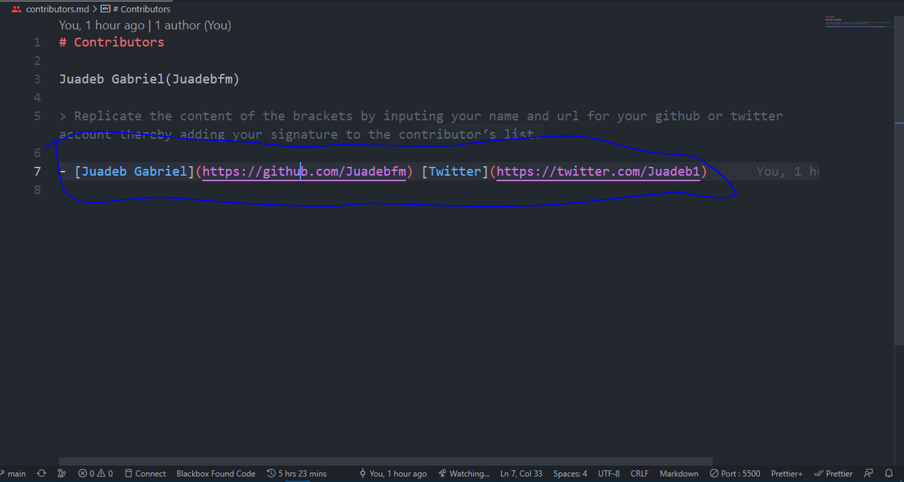

# Quick Access Index

- [**Contribute**](#contribution-steps)
- [**Next Steps**](#next-steps)
- [**Aknowledgements**](#aknowledgements)

# Contribution Steps

- [Quick Access Index](#quick-access-index)
- [Contribution Steps](#contribution-steps)
- [Setup](#setup)
- [Step 1 Fork This Repository](#step-1-fork-this-repository)
- [Clone the repository](#clone-the-repository)
- [Create a new branch](#create-a-new-branch)
- [Open the contributos.md file first](#open-the-contributosmd-file-first)
- [Apply your changes](#apply-your-changes)
  - [We'll now start editing contributors.md (and other additional files you might have added), changing the customizable lines as advised.](#well-now-start-editing-contributorsmd-and-other-additional-files-you-might-have-added-changing-the-customizable-lines-as-advised)
- [Commit your changes](#commit-your-changes)
- [Push your changes to github](#push-your-changes-to-github)
- [Submit a PR(Pull Request)](#submit-a-prpull-request)
- [Celebrate](#celebrate)
- [Next Steps](#next-steps)
- [Aknowledgements](#aknowledgements)
- [Project Info](#project-info)
- [Maintainers](#maintainers)

# Setup

First let's get setup to do the work.
If you're not good with the command line interface [here is the GUI tutorial using github desktop](./README.md)

- If you dont have git [install it from here](https://git-scm.com)

# Step 1 Fork This Repository


Fork this repository by clicking on the fork button on the top of this page. This will create a copy of this repository in your account.

- The objective here is to make a copy of this project and place it in your account.
- A repository (repo) is how a project is called on GitHub and a fork is a copy of it.
- Make sure you are on the [main page](https://github.com/Juadebfm/Vanilla-JS-Projects "https://github.com/Juadebfm/Vanilla-JS-Projects") of this repo.

# Clone the repository


Now we want to make a local copy of the project.<br> That is a copy saved on your own machine.

- Now clone this repo to your machine. Click on the clone button and then click the copy to clipboard icon.
- A repository (repo) is how a project is called on GitHub and a fork is a copy of it.

Open a terminal and run the following git command:

```bash
git clone "url you just copied"
```

For example:

```bash
git clone https://github.com/this-is-you/Contribute-To-This-Project.git
```

where `this-is-you` is your GitHub username. Here you're copying the contents of the first-contributions repository on GitHub to your computer.

# Create a new branch

Change to the repository directory on your computer (if you are not already there):

```bash
cd Vanilla-JS-Projects
```

Now create a branch using the `git checkout` command

```bash
git checkout -b your-new-branch-name
```

For example:

```bash
git checkout -b add-my_branch
```

**Do NOT work on the `master` branch**

- Now you have created a new branch separate from the master.
- For the next steps make sure you are working in this branch. You will see the name of the branch you are on at the bottom left of the text editor youre using where it says `your-branch-name`.

# Open the contributos.md file first

Now we need to open the file we are going to edit with your favourite code editor.

- The `index.html` file is directly in the `Contribute-To-This-Project` folder.

- Now you have the file you are going to edit open in your editor and you are ready to start making changes to it.

# Apply your changes

## We'll now start editing contributors.md (and other additional files you might have added), changing the customizable lines as advised.



- **Replace 'Juadeb Gabriel' with your name**
- **Note: Change "Twitter" to any social media account of your choice**
- **Insert the URL of your Twitter account `(https://twitter.com/your-user-name)`**
- **Type your in your handle**

# Commit your changes

- Now open the terminal in your project directory and run `git status` and you'll notice that there are no changes made in git.
- You can add those changes you made using the `git-add` command

```bash
git add .
```

- Now commit those changes using the `git commit` command

```bash
git commit -m "Add <your-name>"
```

- Replacing `<your-name>` with your name.

# Push your changes to github

- Now that youve commited your changes, they are only saved locally in your local computer.
- Synchronizing local changes with your repository on GitHub is called a `Push`. You are "pushing" the changes from your local repository to the remote repository on GitHub.
- We use the `git push` command to push changes to github.

```bash
git push origin -u <add-your-branch-name>
```

- Replacing `<add-your-branch-name>` with your branch name.

- After a few seconds the operation is complete and now you have exactly the same copy of this branch on your machine as well as on GitHub.

# Submit a PR(Pull Request)

- This is the moment you have been waiting for; submitting a _Pull Request_ (PR).
- So far all the work you have done has been on the fork of the project, which as you remember resides on your own account of GitHub.
- Now it's time to send your changes to the main project to be merged with it.
- This is called a [_Pull Request_](https://help.github.com/articles/about-pull-requests/ "About Pull Requests - GitHub Help") because you are asking the original project maintainer to "pull" your changes into their project.

- Go to the main page of **your fork** on GitHub (it will have the fork icon and your own user name at the top).
- Towards the top of the repo you will see a highlighted pull request message with a green button.

  ***

  

- **Click on the `Compare and pull request`**

* **This is what the `Open a pull request` page looks like.**
* **REMEMBER _you are trying to merge your branch with the original project not with the `Master` branch on your fork_.**
* **The image below gives you an idea of how the header of your pull request should look like.**
* **On the left is the original project, followed by the master branch. On the right is your fork and the branch you created.**
  


---

- Don't be fazed by all the options. You only need to do these three steps for now.
- Leave the option `Allow edits from maintainers` ticked.
- Now, a _Pull Request_ will be sent to the project maintainer. As soon as it is reviewed and accepted your changes will appear on the main project repo

---

# Celebrate

That's it. You have done it! You have now contributed to open source on GitHub.

You have added code to an open source project: [Juadeb/Vanilla-JS-Projects](https://github.com/Juadebfm/Vanilla-JS-Projects)

Your changes **won't be visible immediately**; first they have to be reviewed, accepted, and merged by the project maintainer. Once they are merged you will recieve notifications.

It is very normal for a reviewer to ask for changes on a PR. Think of it as good practice if it happens to you. Keep an eye for comments and requested changes. Once you make the requested changes (back in your branch) all you have to do is to commit and push your changes. The PR will automatically update with the new changes.

We promise we will try to review and merge as soon as possible but we do this in our spare time, so a few days delay is inevitable.

---

# Next Steps

- Come back in a while to check for your merged Pull Request.
- You should receive an email from GitHub when your changes have been approved, or if additional changes are requested. And when the PR is finally merged with the master and your card has been added.
- If you found this project **useful** please give it a :star: star :star: at the top of the page and **Tweet** about it to help spread the word [](https://twitter.com/intent/tweet?text=Contribute%20To%20This%20Project.%20An%20easy%20project%20for%20first-time%20contributors,%20with%20a%20full%20tutorial.%20By%20@Juadebfm&url=https://github.com/Juadebfm/Vanilla-JS-Projects&hashtags=opensource "Tweet this project")
- You can **follow me** and get in touch on [Twitter](https://twitter.com/Juadeb1 "@Juadeb1")
- This is an open source project so apart from contributing your name and socials you are welcome to help fix bugs, improvements, or new features. Open an [issue](https://help.github.com/articles/creating-an-issue/ "Mastering Issues | GitHub Guides") or send a new [pull request](https://help.github.com/articles/creating-a-pull-request-from-a-fork/ "Creating a pull request from a fork | GitHub Help")
- To help improve our community discussion will be here [Discussions](https://github.com/Juadebfm/Vanilla-JS-Projects/discussions) tab located next to Pull Requests. This area is a place to introduce yourself, go into deeper discussions on Open Source, and communicate with the Project Maintainers. Will you help us build out this feature and enhance our community?
- **Thanks for contributing to this project**. Now you can go ahead and try contributing to other projects; look for the  label for beginner-friendly contribution options.
- I'm also looking for collaborators to give me a hand in reviewing and merging PRs. If you would like to get more advanced Git practice please send me a DM on Twitter and read the [maintainer's guide](maintainers.md).

# Aknowledgements

This project is heavily influenced by [Skynapse](https://github.com/Syknapse) great [first-contributions](https://github.com/Syknapse/Contribute-To-This-Project) project with its excellent tutorial. And also by my silent mentor [Codrops](https://github.com/codrops)

# Project Info

[](https://github.com/Juadebfm/Vanilla-JS-Projects/blob/master/LICENSE)

<!--  -->


# Maintainers


[Back to the top &uparrow;](#quick-access-index)
